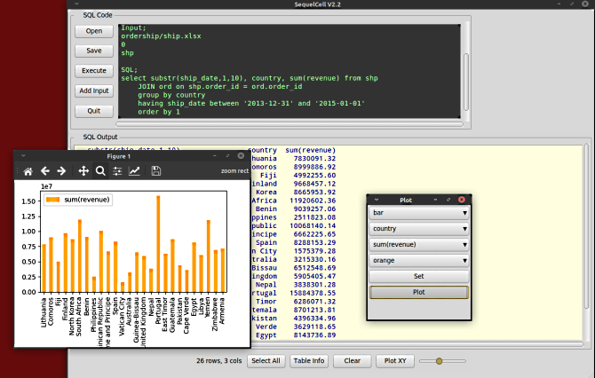
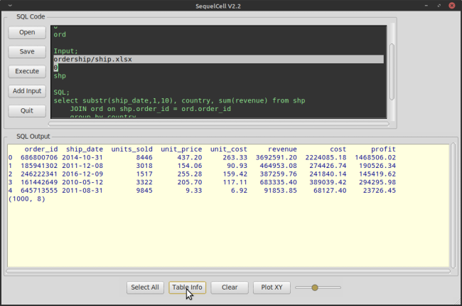

# SequelCell

**SequelCell is a desktop app lets you easily combine data from  
several different input types and assess them using standard  
SQL language statements.**

Input types:  
- Excel spreadsheets
- CSV files
- SQLite database tables

**Also you can output the query result to a file in any of the  
three formats.**

**Furthermore, multiple sheets, from an Excel workbook, and multiple  
tables from an SQLite database can be input and accessed together  
with other inputs by the SQL.**  

**SequelCell can produce simple charts for data visualization.**  

**SequelCell (sqlcel.py) may be run as a GUI app or from the  
command line.**

SequelCell **does not** execute SQL "update" and "insert" commands.



## Using SequelCell

SequelCell has a few Python system requirements:

- Python 3.x
- modules:
  - tkinter
  - ttkthemes
  - pandas
  - matplotlib
  - sqlalchemy

### Run as GUI app
`> python sqlcel.py` 

### Run in CONSOLE
`> python sqlcel.py` _sqlCodeFile.txt_

### The SQL code file
Each `SQL` query is coded into a text file where the inputs, optional output,  
and sql statement are defined. The three tags: "__`Input;`__", "__`Output;`__",  
and "__`SQL;`__" are case insensitive, but must appear on a single line  
and end with the ";" semi-colon. You can have more than one "__`Input;`__"  
statement. "__`Input;`__" and "__`Output;`__" statements must appear before  
the "__`SQL;`__" statement.

__`Input;`__ 
: defines the Excel, CSV, or Sqlite input file path, with sheet name
: or number, or database table name. SQL table name to use in the query.  
: You can have multiple "__`Input;`__" statements.

Example:
```
Input;
insurance/sales.xlsx
0
sal
```
To insert a new **"Input;"** section use the __Add Input__ button.  
Code is inserted at the cursor location in the code frame.  
The **"Input;"** tag must come before the "__SQL;__" tag.  
Note, you may have to code the actual "sheet" (name or number)  
and "table" name that you want to use in the sql query.

The "0" seen on the line after the input file path is the sheet number.  
Sheet numbers (zero relative) only work with Excel spreadsheets.  
Instead of a number you can type in the actual sheet name if you want to.  
Each "__Input;__" section will load only 1 sheet/table.  
The workbook may contain more than one sheet, and you may access another  
sheet from the workbook by defining another **"Input;"** statement.  
For CSV files the "0", sheet name or number, is simply ignored.  
For Sqlite databases change the "0" to the name of the database table  
you wish to access.

The third line inserted defaults to "__tbl__" when using the "__Add Input__" button.  
This is the table name that will be used in the SQL statement for this input.  
Change this to whatever you want to use for a table name in the SQL select.

__`Output;`__ 

: defines the _optional_ Excel, CSV, or Sqlite output file path.  
: You can have just 1 "__`Output;`__" statement.

Example:
```
Output;
insurance/profits.db
```
The optional "__Output;__" tag may be included anywhere above the "__SQL;__" tag.  
Under the "__Output;__" tag type in the fullpath for your  
output Excel, CSV, or Sqlite database file. When using Excel as the  
output target file, the output sheet name will always be "sheet1".  
When using Sqlite for output file the table name will always be "table1".  
Use ".db" for the Sqlite output file's extention.

__`SQL;`__ 
: indicates the SQL select statement is to follow.

Example:
```sql
Sql;
select sal.Item, sum(Amount), sum(Cost), count(*), 
		 sum((Amount - Cost)) Profit
    from sal, cst
    group by sal.Item
    order by Profit
```
Everything beyond the **"Sql;"** tag is part of the sql select statement.  

__`#`__ 
: indicates a comment line (only at beginning of line)  
: Blank lines and comments are discarded when  
: the code file is parsed.  

Command lines and blank lines are permitted anywhere throughout file.

**Example of a simple code file:**  
```sql
# sql7.txt : Find sales amount by month

Input;
sales/orders.xlsx
0
ord

SQL;
select sum(purch_amt) from ord
	group by ord_date
```  
In this example `orders.xlsx` resides in the 'sales' directory.  
The 'sales' directory shares a directory with `sqlcel.py`.  
The **`Input;`** and **`Output;`** statements can also use fully  
qualified paths. 

### Preview columns & row data
Select the (line) with the Excel or CSV file path in the code frame.  
For Excel select both the path line and the sheet line.  
Then click the __Table Info__ button to view the columns  
and 5 rows of data in the output frame.

With the file path line and sheet line selected,  
click the __Execute__ button to _preview the entire sheet/table_.

Previewing is not implemented for Sqlite database tables.

With nothing selected in the code frame clicking the __Execute__ button  
runs the SQL statement showing the results in the output frame.  



### Run the SQL
With nothing selected in the code frame click the __Execute__ button  
to run the SQL statement. The results will appear in the  
"SQL Output" frame. The "Select All" and "Clear" buttons at  
the bottom of the app refer to the "SQL Output" frame.

Use the __Open__ and __Save__ buttons to load and save the SQL code.  
Use Ctrl-S to quickly save the loaded code file. Ctrl-q and Esc will 
prompt to exit the app.

The "Plot" button lets you select one or more X/Y columns to graph.  
After setting each _type, axis, and color,_ click _Set_. Click _Plot_  
after setting up all of the coordinate variables.

###Style
For some style variations backgrounds, foregrounds, and fonts can  
be tweaked in the `sqlcel.ini` file.

```text
# sqlcel.ini

# These are for the SQL Code frame Text
Font = Consolas
Size = 11
Backg = #333333
Foreg = lightgreen
Tab = 4
Cursor = lightgreen

# These are for the SQL OUTPUT frame Text
Ofont = Noto Mono
Obg = lightyellow
Ofg = darkblue

```

end
